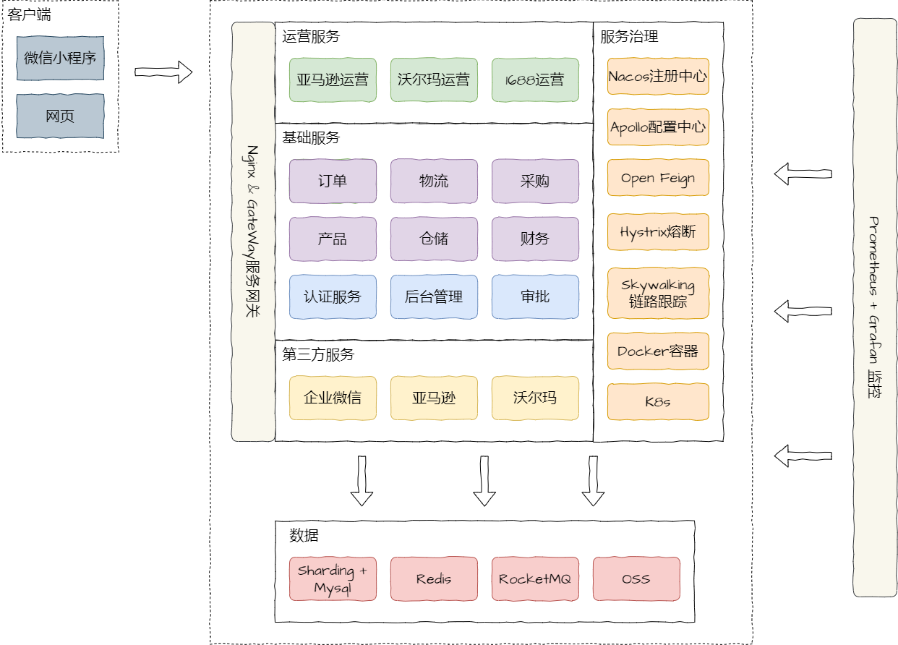

# YIHONG-ERP

## ERP

> 管理公司资源和核心的业务流程, 信息互通, 优化流程, 提高协作效率.

## 项目结构

```text
ERP
├── gateway           网关
├── auth              认证中心
├── admin             用户服务
├── product           产品服务
├── order             订单服务
├── warehouse         仓储服务
├── purchase          采购服务
├── logistics         物流服务
├── financial         财务服务
├── approval          审批服务
├── marketing-amazon  亚马逊营销服务
├── marketing-1688    1688营销服务
└── marketing-walmart 沃尔玛营销服务
```

## 服务架构


## 服务职责

### 产品服务
- 基础功能
  - 产品SPU管理 
  - 产品SKU管理
  - 产品分类管理
  - 品牌管理
- 业务流程
  - 市场调研
  - 新品开发
  - 辅料需求
  - 包装设置
  - 设计需求
  - 成本核算
### 采购服务
- 基础功能
  - 合同模板管理
  - 供应商管理
  - 供应商报价管理
  - 采购单管理
- 业务流程
  - 采购计划
  - 新品请购
### 仓储服务
- 基础功能
  - 仓库信息管理
  - 仓库库存管理
  - 批次库存管理
  - 出库管理
  - 入库管理
  - 拦截管理
- 业务流程
  - 调柜
  - 发货流程
  - 质检流程
### 物流服务
- 基础功能
  - 物流商管理
  - 物流单管理
  - 物流时效管理
  - 物流商报价管理
  - 报关单管理
- 业务流程
  - 物流跟踪
  - 舱位预报
### 财务服务
- 基础功能
  - 公司管理
  - 付款申请管理
  - 付款单管理
  - 付款记录管理
  - 发票管理
### 订单服务
- 基础功能
  - 订单管理
- 辅助功能
  - 订单物流信息
  - 订单折扣信息
  - 订单付款信息
### 亚马逊营销服务
- 基础功能
  - 店铺管理
  - listing-asin管理
  - listing-sku管理
  - 产品分级管理
  - 销售目标管理
- 业务流程
  - 备货规划
  - 备货计算
  - 预测日销
  - 广告促销
  - 销售管理
### 1688营销服务
- 基础功能
  - listing-asin管理
  - listing-sku管理
  - 产品分级管理
  - 销售目标管理
- 业务流程
  - 备货规划
  - 备货计算
  - 预测日销
  - 广告促销
  - 销售管理
### 沃尔玛营销服务
- 基础功能
  - listing-asin管理
  - listing-sku管理
  - 产品分级管理
  - 销售目标管理
- 业务流程
  - 备货规划
  - 备货计算
  - 预测日销
  - 广告促销
  - 销售管理
### 审批服务
- 基础功能
  - 审批配置管理(审批节点, 审批条件, 抄送和通知)
  - 审批单管理
  - 审批节点记录
  - 审批抄送记录
### 后台管理服务
- 基础功能
  - 部门管理
  - 用户管理
  - 角色管理
  - 权限管理
  - 菜单管理
  - 菜单功能管理
  - 用户角色管理
  - 角色权限管理
  - 系统配置管理
  - 系统消息
### 认证服务
- 基础功能
  - 身份注册
  - 身份认证

## 数据库设计
> 数据库表设计规范:
> 
> 1. [必须] 表主键使用自增ID, 类型为 `bigint unsigned`: `id bigint unsigned auto_increment not null comment '自增ID' primary key`
> 2. [必须] 表中有一个唯一键作为业务ID(作为分表分库的ID), 类型为`varchar(32)`, [推荐]字段名推荐使用 `表名_id`: `表名_id varchar(32) uniqu not null comment 'xxxID'`
> 3. [必须] 表必须包含创建时间:`create_time`和修改时间:`update_time`, 时间类型使用 `datetime`, 不使用数据库的默认时间: 如`default current_timestamp [on update current_timestamp]`
> 4. [推荐] 名称字段使用 `varchar(64)`, 描述、备注和URL字段使用 `varchar(256)`

### 用户服务


### 产品服务


### 订单服务


### 仓储服务


### 物流服务


### 财务服务


### 审批服务


### 亚马逊营销服务


### 1688营销服务


### 沃尔玛营销服务


